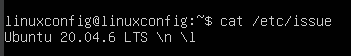
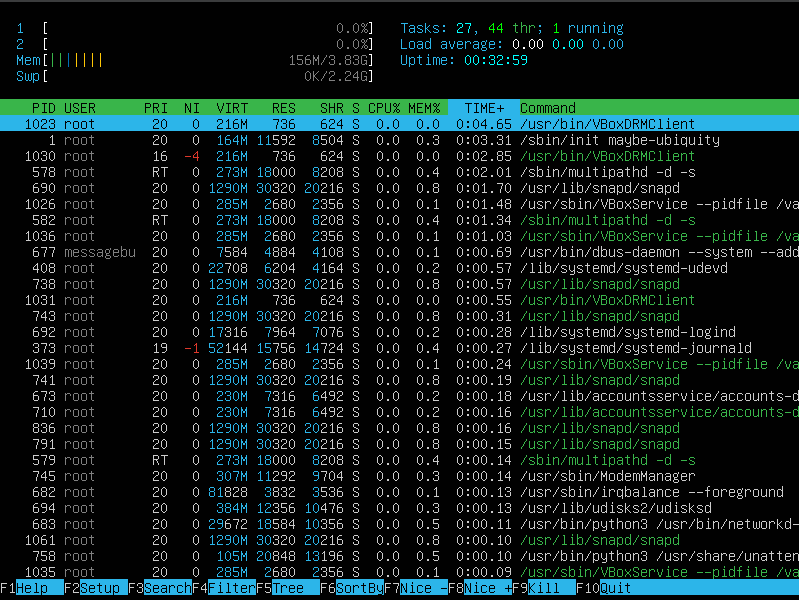
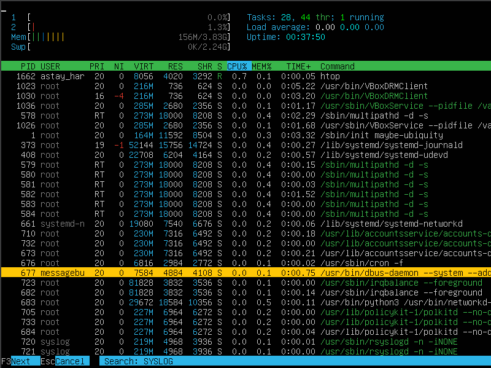
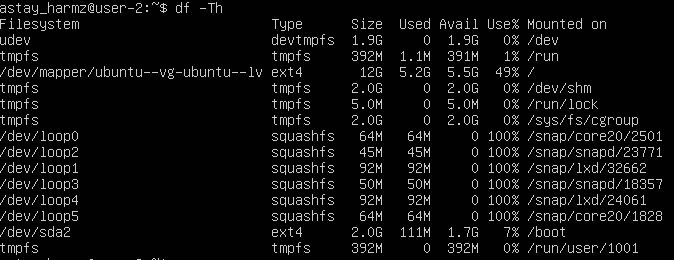
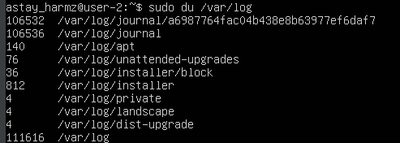
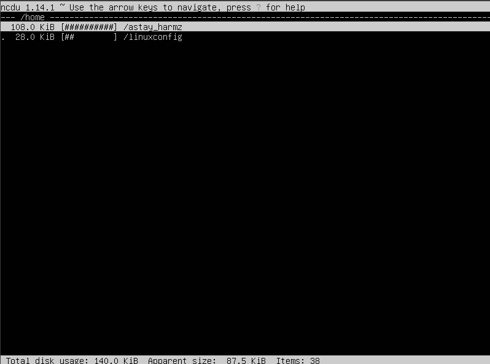

## Part 1. Установка ОС

* Скачиваем установочный файл с официального сайта: https://releases.ubuntu.com/20.04/
* Запускаем программу виртуализации (https://www.virtualbox.org/wiki/Downloads)
* Настройка перед установкой
    * Выбрать язык
    * Выбрать раскладку клавиатуры
    * Настроить сети
    * Настроить прокси-сервера
    * Настроить сервера обновлений
    * Настроить разметку диска
    * Конфигуратор хранилища
    * Создать учетную запись (Задать имя, название сервера, имя пользователя и пароль)
    * Устанавливаем OpenSSH
    * Выбираем рекомендуемые снимки сервера и компоненты сервера
* После настройки ждем окончания загрузки

* Проверяем версию Ubuntu с помощью команды cat /etc/issue

> <i>Проверка версии</i>

## Part 2. Создание пользователя

* Создаем нового пользователя через команду sudo adduser

> <i>Вызов команды adduser</i>

* Добавляем пользователя в группу adm и проверяем, что он добавился в группу

> <i>Добавление в группу</i>

* Смотрим, что новый пользователь есть в выводе команды cat /etc/passwd (последняя строка)

> <i>Вывод содержимого /etc/passwd</i>

## Part 3. Настройка сети ОС

* Зададим название машины вида user-1

> <i>Вывод команды для изменения имени и проверка</i>

* Установим временную зону

> <i>Задаем временную зону Europe/Moskow</i>

* Выведем названия сетевых интерфейсов с помощью команды ip link show
* Lo (или Loopback interface) - это виртуальный сетевой интерфейс, который используется для отладки сетевых программ и запуска серверных приложений на локальной машине

> <i>Вывод команды ip link show</i>

* Используя консольную команду, получим ip адрес устройства от DHCP-сервера
* DHCP (Dynamic Host Configuration Protocol) - это сетевой протокол, который автоматически назначает устройствам IP-адреса и другие сетевые параметры. Он избавляет от необходимости настраивать сеть вручную

> <i>Запрашиваем у DHCP-сервера IP-адрес</i>

* Выведем внешний ip-адрес шлюза (ip) и внутренний IP-адрес шлюза, он же ip-адрес по умолчанию (gw)

> <i>Внешний адрес</i>

> <i>Внутренний адрес</i>

* Зададим статичные настройки ip, gw, dns (используем публичный DNS-серверы, например 1.1.1.1 или 8.8.8.8). Для этого откроем файл /etc/netplan/00-installer-config.yaml в редакторе

> <i>Содержимое файла</i>

* Сохраним файл и перезагрузим виртуальную машину

> <i>Пинг удаленных хостов 1.1.1.1 и ya.ru</i>

## Part 4. Обновление ОС

* Установим обновления системных пакетов, для этого введем команды sudo apt update и sudo apt upgrade

> <i>Повторный вызов команд, чтобы убедиться, что все обновления установлены</i>

## Part 5. Использование команды sudo

* sudo (Super User DO) - команда, позволяющая пользователям выполнять команды от имени администратора
* Чтобы дать пользователю разрешение использовать команду sudo, введем следующую команду: sudo usermod -aG sudo <имя пользователя>
* Поменяем hostname ОС от имени пользователя, созданного в пункте Part 2 (Для этого переключаемся на другого пользователя через команду su и от его имени вводим нужную команду)

> <i>Меняем hostname</i>

## Part 6. Установка и настройка службы времени

* Настроим службу автоматической синхронизации времени

> <i>Включение синхронизации</i>

> <i>Проверка статуса синхронизации</i>

## Part 7. Установка и использование текстовых редакторов

* Установим 3 текстовых редактора: vim, nano и mcedit с помощью команды sudo apt install

> <i>Вызовем команду еще раз для проверки</i>

* Создаем файлы test_VIM.txt, test_NANO.txt и test_MCEDIT.txt с помощью команды touch
* Откроем test_VIM.txt через редактор VIM

> <i>Для редактирования нажать i. Ввожу свой никнейм, затем нажать esc. Чтобы сохранить файл нажать комбинацию :wq</i>

> <i>Удаляем строку, для этого используем комбинацию dd. Для редактирования нажать i, выйти из режима редактирования на esc. Чтобы выйти без сохранений используем комбинацию :q!</i>

> <i>Для поиска нажать / и ввести строку, редактор подсвечивает вхождение</i>

> <i>Для замены ввести команду :%s/<искомое_слово>/<замена></i>

* Откроем test_NANO.txt через редактор NANO

> <i>Ввожу свой никнейм, затем нажать ctrl+S для сохранения. Чтобы выйти из файла, нажать комбинацию ctrl+X</i>

> <i>Удаляем строку. Чтобы выйти без сохранений, используем комбинацию ctrl+X, затем нажимаем N</i>

> <i>Для поиска нажать ctrl+W и ввести строку, редактор подсвечивает вхождение</i>

> <i>Для замены нажать ctrl+\ , ввести сначала искомое слово, потом замену и выбрать, заменить только одно вхождение или все</i>

* Откроем test_MCEDIT.txt через редактор mcedit

> <i>Ввожу свой никнейм, затем нажать F10 для выхода. Чтобы сохранить файл, выберите опцию "yes"</i>

> <i>Удаляем строку на F8. Чтобы выйти без сохранений, также нажимаем F10, затем выбираем "no"</i>

> <i>Для поиска нажать F7 и ввести строку, редактор подсвечивает вхождение</i>

> <i>Для замены нажать F4, ввести сначала искомое слово, потом замену</i>

## Part 8. Установка и базовая настройка сервиса SSHD

* Устанавливаем службу SSHd (если еще не установлена) и включаем автостарт при запуске системы

><i>Добавляем автостарт</i>

* Открываем sudo nano /etc/ssh/sshd_config и раскомментируем строку "Port 22", меняем ее на "Port 2022", после чего перезапускаем службу с помощью команды sudo systemctl restart sshd

><i>Так выглядит файл /etc/ssh/sshd_config</i>

* Запустим команду ps и посмотрим наличие процесса sshd
* ps (Process Status) — утилита для просмотра информации о запущенных процессах. Она показывает их идентификаторы (PID), состояние, использование ресурсов и другие параметры. Ключи:
    * -A, -e, (a) - выбрать все процессы
    * -a - выбрать все процессы, кроме фоновых
    * -d, (g) - выбрать все процессы, даже фоновые, кроме процессов сессий
    * -N - выбрать все процессы кроме указанных
    * -С - выбирать процессы по имени команды
    * -G - выбрать процессы по ID группы
    * -p, (p) - выбрать процессы PID
    * --ppid - выбрать процессы по PID родительского процесса
    * -s - выбрать процессы по ID сессии
    * -t, (t) - выбрать процессы по tty
    * -u, (U) - выбрать процессы пользователя

><i>Выводит процесс</i>

* netstat - команда для вывода списка открытых портов и соответствующих им адресов, таблиц маршрутизации и скрытых соединений. Ключи:
    * -t	Показывать TCP-соединения (протокол с установкой соединения).
    * -a	Отображать все соединения (включая слушающие порты).
    * -n	Выводить адреса и порты в числовом формате (без DNS-преобразования).

* Вывод команды netstat содержит следующую информацию:
    * Proto	- тип протокола
    * Recv-Q - размер буфера необработанных данных, которые ждут чтения программой (в байтах)
    * Send-Q - размер буфера данных, готовых к отправке, но ещё не переданных (в байтах)
    * Local Address	- локальный IP и порт
    * Foreign Address - удалённый IP и порт (для входящих соединений)
    * State - состояние соединения 

* 0.0.0.0 — это специальный IP-адрес, означающий "все доступные сетевые интерфейсы" или "любой адрес"

><i>Вывод команды netstat -tan</i>

## Part 9. Установка и использование утилит top, htop

* Запускаем команду top
    * uptime - 18 min
    * количество авторизованных пользователей - 1
    * средняя загрузка системы - 0,00 0,01 0,00
    * общее количество процессов - 107
    * загрузка cpu - 0.0 us 0.0 sy 0.0 ni 99.8 id 0.2 wa 0.0 hi 0.0 si 0.0 st
    * загрузка памяти - 3919.9 total, 3354.9 free, 155.2 used, 409.8 buff/cache
    * pid процесса занимающего больше всего памяти - 1
    * pid процесса, занимающего больше всего процессорного времени - 1023

><i>Вывод команды top</i>

* Запускаем команду htop

><i>Отсортированный по PID</i>

><i>Отсортированный по PERCENT_CPU</i>

><i>Отсортированный по PERCENT_MEM</i>

><i>Отсортированный по TIME</i>

><i>Отфильтрованный для процесса sshd</i>

><i>С процессом syslog, найденным, используя поиск</i>

><i>С добавленным выводом hostname, clock и uptime</i>

## Part 10. Использование утилиты fdisk

* Запустим команду fdisk -l
* 
    * Название жесткого диска - sda
    * Размер - 25 GiB
    * Количество секторов - 52428800
    * Размер swap - 2.2 GiB

><i>Вывод fdisk -l</i>

><i>Вывод swapon --show</i>

## Part 11. Использование утилиты df

* Запускаем команду df
    * Размер раздела - 11758760
    * Размер занятого пространства - 5441896
    * Размер свободного пространства - 5697756
    * Процент использования - 49%
    * Единица измерения - KB

><i>Вывод команды df</i>

* Запускаем команду df -Th
    * Размер раздела - 12G
    * Размер занятого пространства - 5.2G
    * Размер свободного пространства - 5.5G
    * Процент использования - 49%
    * Тип файловой системы - ext4

><i>Вывод команды df -Th</i>

## Часть 12. Использование утилиты du

* Выведем размер папок /home, /var, /var/log

><i>В байтах и в человекочитаемом виде</i>

* Выведем размер всего содержимого в /var/log

><i>Размер каждого элемента /var/log по-отдельности</i>

## Part 13. Установка и использование утилиты ncdu

* Установим утилиту ncdu с помощью команды sudo apt install 
* Выведем размер папок /home, /var, /var/log

><i>Размер папки /home</i>

><i>Размер папки /var</i>

><i>Размер папки /var/log</i>

## Part 14. Работа с системными журналами

* Откроем логи:
1. /var/log/dmesg
2. /var/log/syslog
3. /var/log/auth.log

    * Время последней успешной авторизации - Apr 19 23:55:10
    * Имя пользователя - astay_harmz
    * Метод входа в систему - pam_unix(login:session)

><i>Последняя успешная авторизация из var/log/auth.log</i>

* Перезапустим службу SSHd с помощью команды sudo systemctl restart ssh
* Найдем запись об этом действии в логах

><i>Логи var/log/syslog</i>

## Part 15. Использование планировщика заданий CRON

* Используя планировщик заданий, запустим команду uptime через каждые 2 минуты
* Редактируем планировщик заданий (crontab -e), вставляем в файл строку */2 * * * * uptime и сохраняем

><i>Логи var/log/syslog</i>

* Выведем список текущих задач с помощью команды crontab -l

><i>Текущие задачи для CRON</i>

* Удалим задачи из планировщика с помощью команды crontab -r

><i>Удаляем задачу</i>